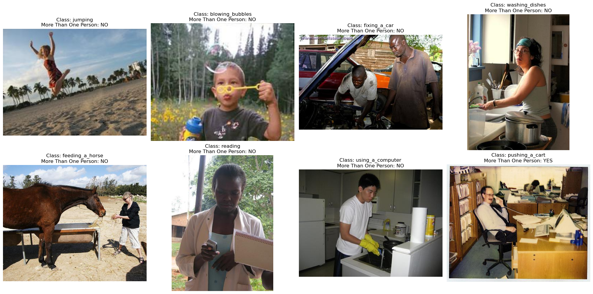

# Multi-Task Human Action Recognition

### Project Overview

Human Action Recognition (HAR) involves identifying actions performed by individuals from images or videos. This project focuses on developing a deep convolutional neural network (CNN) to recognize actions from still images. The system is designed to predict both the specific action of a person and whether there are multiple people in the image.




### Key Objectives

- Action Recognition: Identify the action performed by a person in an input RGB image (Multi-Classification of 40 classes)
- Multi-Person Detection: Determine if more than one person is present in the image (Binary Classification)

### Model Architectures

The base model used for this project is VGG16, with the last 4 layers unfrozen. It uses global average pooling followed by two dense layers, each serving a different task:

- Output1: Multi-class classification (40 classes)
- Output2: Binary classification (more than one person)

The architecture is flexible and can be customized by experimenting with other pre-trained models, adjusting the number of trainable layers, or modifying the output layers. You can also use separate branches for different tasks or a combined branch structure.

### Repository Structure

```bash

Multi-Task-Human-Action-Recognition
│
├── README.md
├── conda_list.txt
│
├── configs
│   └── config.yaml
|
├── data
│   ├── Images
│   ├── final_predictions.csv
│   ├── future_data_2024.csv
│   └── train_data_2024.csv
│
├── notebooks            
│   └── notebook.ipynb              # Simple exercise notebook
│
├── results
│   ├── classes_cm_results.png
│   ├── final_predictions.csv
│   ├── more_than_one_person_results.png
│   └── training_performance.png
|
└── src
    └── Modules.py            # Main project modules
```
